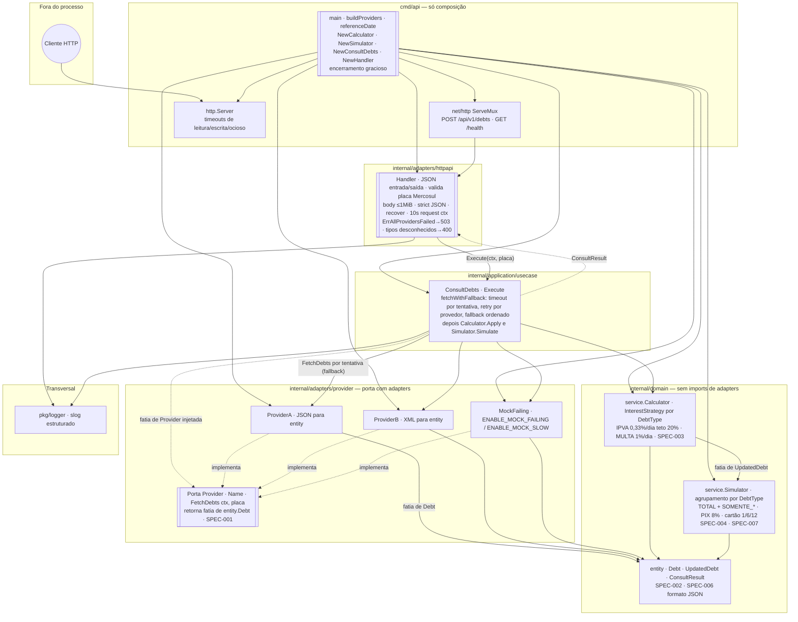

# car-payment-gateway

Serviço de consulta de débitos veiculares e simulação de pagamento, criado como teste caseiro de engenharia de backend.

## Como executar

### Pré-requisitos
- Go 1.24+
- Docker (opcional)

### Local

```bash
# Clonar e entrar no repositório
git clone https://github.com/celsoadsjr/car-payment-gateway
cd car-payment-gateway

# Subir
make run          # sobe em :3000

# Testes
make test         # todos os testes, sem verbosidade
make test-verbose # com saída detalhada
make test-race    # mesma suíte com detector de corrida (-race)
make coverage     # cobertura (coverage.out + resumo no terminal)

# Qualidade
make lint         # go vet ./...

# Binário
make build        # gera em bin/
```

### Docker

```bash
make docker-run   # build da imagem e execução em :3000
```

### Demo: fallback em ação

```bash
make demo-fallback
# Sobe com o provider MockFailing primeiro na cadeia.
# Os logs mostram WARN para o MockFailing e INFO quando o ProviderA obtiver sucesso.
```

### Demo: timeout por tentativa

```bash
make demo-timeout
# Primeiro provedor segura até o timeout da tentativa (3s por padrão); depois o fallback segue para A/B.
# Os logs devem mostrar deadline exceeded no mock e sucesso no próximo provedor.
```

### Demo: retry com backoff

Cada provedor pode ser retentado antes do fallback para o próximo:

```bash
# Retry sem backoff (tentativas imediatas)
PROVIDER_MAX_ATTEMPTS=3 make demo-fallback
# Logs mostram "attempt 1/3 failed, retrying", "attempt 2/3 failed, retrying", "attempt 3/3 failed, trying next"

# Retry com backoff de 500ms entre tentativas
PROVIDER_MAX_ATTEMPTS=3 PROVIDER_RETRY_BACKOFF_MS=500 make demo-fallback
# Cada falha aguarda 500ms antes da próxima tentativa no mesmo provedor

# Combinar timeout + retry
PROVIDER_MAX_ATTEMPTS=2 PROVIDER_RETRY_BACKOFF_MS=100 make demo-timeout
# MockFailing tenta 2x (com 100ms de pausa), depois ProviderA tenta 2x
```

**Variáveis:**
- `PROVIDER_MAX_ATTEMPTS` (default 1): tentativas por provedor antes de fallback
- `PROVIDER_RETRY_BACKOFF_MS` (default 0): pausa em ms entre tentativas (0 = desligado)

Roteiro passo a passo para apresentação alinhada ao enunciado (HomeTest): [docs/HomeTest-playbook.md](docs/HomeTest-playbook.md).

## API

### `POST /api/v1/debts`

Consulta débitos e simula opções de pagamento para uma placa de veículo.

**Requisição:**
```json
{ "placa": "ABC1234" }
```

**Resposta (200):** valores monetários são **strings** decimais (`shopspring/decimal`).

Com `REFERENCE_DATE=2024-05-10` (alinhado com HomeTest.pdf):

```json
{
  "placa": "ABC1234",
  "debitos": [
    {
      "tipo": "IPVA",
      "valor_original": "1500.00",
      "valor_atualizado": "1800.00",
      "vencimento": "2024-01-10",
      "dias_atraso": 121
    },
    {
      "tipo": "MULTA",
      "valor_original": "300.50",
      "valor_atualizado": "555.93",
      "vencimento": "2024-02-15",
      "dias_atraso": 85
    }
  ],
  "resumo": {
    "total_original": "1800.50",
    "total_atualizado": "2355.93"
  },
  "pagamentos": {
    "opcoes": [
      {
        "tipo": "TOTAL",
        "valor_base": "2355.93",
        "pix": { "total_com_desconto": "2238.13" },
        "cartao_credito": {
          "parcelas": [
            { "quantidade": 1,  "valor_parcela": "2355.93" },
            { "quantidade": 6,  "valor_parcela": "417.81"  },
            { "quantidade": 12, "valor_parcela": "233.07" }
          ]
        }
      },
      {
        "tipo": "SOMENTE_IPVA",
        "valor_base": "1800.00",
        "pix": { "total_com_desconto": "1710.00" },
        "cartao_credito": {
          "parcelas": [
            { "quantidade": 1,  "valor_parcela": "1800.00" },
            { "quantidade": 6,  "valor_parcela": "319.23"  },
            { "quantidade": 12, "valor_parcela": "178.07" }
          ]
        }
      },
      {
        "tipo": "SOMENTE_MULTAS",
        "valor_base": "555.93",
        "pix": { "total_com_desconto": "528.13" },
        "cartao_credito": {
          "parcelas": [
            { "quantidade": 1,  "valor_parcela": "555.93" },
            { "quantidade": 6,  "valor_parcela": "98.58"  },
            { "quantidade": 12, "valor_parcela": "55.00" }
          ]
        }
      }
    ]
  }
}
```

**Respostas de erro:**

| Status | Motivo |
|--------|--------|
| 400 | JSON inválido, campo `placa` ausente, placa fora do padrão Mercosul/antigo, ou todos os débitos com tipo desconhecido |
| 413 | Corpo da requisição maior que 1 MiB |
| 503 | Todos os provedores indisponíveis |
| 500 | Erro interno inesperado |

**Validação e hardening:** corpo limitado a **1 MiB** (`MaxBytesReader`), JSON sem campos desconhecidos (`DisallowUnknownFields`), placa no formato `^[A-Z]{3}-?[0-9][A-Z0-9][0-9]{2}$`, middleware de **recover** em panic, placa **mascarada** nos logs (`ABC-****`).

**Variáveis de ambiente:** `PORT`, `ADDR`, `REFERENCE_DATE`, `LOG_LEVEL`, `ENABLE_MOCK_FAILING`, `ENABLE_MOCK_SLOW`, `PROVIDER_MAX_ATTEMPTS`, `PROVIDER_RETRY_BACKOFF_MS`. Ver [.env-example](.env-example) e [SPEC-005](docs/SPEC-005-fallback.md).

### `GET /health`

Retorna `{"status":"ok"}` para probes de liveness.

---

## Arquitetura

O projeto segue **Clean Architecture** (também chamada Hexagonal / Ports & Adapters).

O diagrama abaixo mostra como uma requisição de consulta atravessa o adapter HTTP, o caso de uso da aplicação (cadeia de fallback nos provedores e depois os serviços de domínio) e quais pacotes respondem por cada responsabilidade. As setas de dependência apontam **para dentro**: o domínio não importa HTTP nem implementações concretas de provedores.



```
cmd/api/              ← ponto de entrada, só wiring
internal/
  domain/             ← regras de negócio puras, sem imports de camadas externas
    entity/           ← modelos canônicos (Debt, PaymentOption, …)
    service/          ← Calculator (juros), Simulator (serviços de domínio)
  application/
    usecase/          ← ConsultDebts: orquestra provedores + domínio
  adapters/
    provider/         ← ProviderA (JSON), ProviderB (XML), MockFailing
    httpapi/          ← handler HTTP, middleware (recover), tradução requisição/resposta
pkg/
  logger/             ← wrapper slog estruturado
```

**Regra de dependência:** camadas internas nunca importam as externas.
O pacote `domain` não conhece HTTP nem provedores.
O pacote `application` conhece apenas portas (interfaces), nunca adapters concretos.

---

## Desenvolvimento orientado a especificação

Foi aplicado **Spec-Driven Development**: antes de qualquer implementação,
todos os contratos foram definidos como interfaces e tipos em Go:

| Spec | Descrição |
|------|-----------|
| SPEC-001 | Interface `provider.Provider` (porta que todo provedor deve satisfazer) |
| SPEC-002 | Modelo canônico `entity.Debt` (normalizado a partir de qualquer formato de provedor) |
| SPEC-003 | Regras de juros: juros simples, IPVA 0,33%/dia teto 20%, MULTA 1%/dia |
| SPEC-004 | Regras de pagamento: desconto PIX 8%, cartão `base*(1.025)^n/n` para n∈{1,6,12} |
| SPEC-005 | Contrato de fallback: retry por provedor, ordem fixa, primeiro sucesso vale, timeout por tentativa |
| SPEC-006 | Contrato HTTP: `POST /api/v1/debts`, JSON entrada/saída |
| SPEC-007 | Pagamento parcial: TOTAL + uma opção por DebtType, gerada automaticamente |

Os testes são escritos em cima das especificações, não das implementações — passam
independente de qual provedor concreto ou estratégia está em uso.

---

## Padrões de projeto

| Padrão | Onde | Por quê |
|--------|------|---------|
| **Adapter** | `ProviderA`, `ProviderB` | Cada um normaliza um formato de wire (JSON/XML) para `entity.Debt`. Novo Provider C = um arquivo novo. |
| **Strategy** | `Calculator` / `InterestStrategy` | Cada `DebtType` tem sua estratégia (`ipvaStrategy`, `multaStrategy`). Novo tipo = nova estratégia, zero mudança no restante. |
| **Facade** | `ConsultDebts` | Um ponto de entrada que esconde orquestração de provedores, fallback, juros e simulação de pagamento. |
| **Factory (por injeção)** | `main.go` | Fatia de provedores montada no startup. Novo provedor = uma linha em `main.go`. |
| **Group-by** | `Simulator` | Débitos agrupados por `DebtType` via `map`, gerando uma opção parcial por tipo automaticamente — sem condicionais `if debtType == "IPVA"`. |

---

## Trade-offs e decisões

### Modelo de juros simplificado vs. legislação real de SP

O teste usa um modelo simplificado:

| Tipo | Regra do teste | Regra real em SP |
|------|----------------|------------------|
| IPVA | 0,33%/dia, teto fixo de 20% | 0,33%/dia até 60 dias → 20% fixo + **taxa Selic** |
| MULTA | 1%/dia, sem teto | 1º mês 1% fixo → Selic acumulada + 1%/mês (CTB art. 131-A) |

Em produção entraria a tabela mensal de Selic publicada pela SEFAZ-SP.

### Contagem de dias (SPEC-AMBI-02)

O documento do teste fala em "85 dias" para 2024-02-19 → 2024-05-10.
A diferença correta em UTC dá **81 dias** (fevereiro de 2024 tem 29 dias).
`81 dias × 0,01 × R$300,50 = R$543,91` (o spec mostra R$555,93 com base em 85 dias).

Decisão: implementar subtração de datas matematicamente correta (81 dias).
A contagem do spec parece erro manual de contagem. Testes de unidade fixam o comportamento e a divergência fica documentada.

### Fórmula de parcelas no cartão (SPEC-AMBI-03)

O spec diz: `installment = valor_total * (1.025)^n / n`

Aplicando ao próprio exemplo do spec (TOTAL = R$2343,91):

| n | Resultado da fórmula | Exemplo do spec |
|---|----------------------|-----------------|
| 1 | 2343,91 | 2355,93\* |
| 6 | 452,24 | 417,81 |
| 12 | 261,99 | 233,07 |

\*O total do spec também difere por usar MULTA com 85 dias (ver acima).

Os exemplos não batem com a fórmula escrita. A fórmula Price/PMT
(`PV * i / (1 - (1+i)^-n)`) também não reproduz os números do spec.
Decisão: implementar a **fórmula literalmente escrita** e documentar o gap.

### Quantidade de parcelas em SOMENTE_IPVA (SPEC-AMBI-05)

A saída esperada do spec mostra `SOMENTE_IPVA` só com 1 parcela, enquanto
TOTAL e SOMENTE_MULTA mostram 3. Não há regra escrita limitando parcelas por
tipo de débito. Decisão: oferecer 1x/6x/12x de forma consistente em todas as opções.

### Arredondamento (SPEC-AMBI-06)

Valores monetários usam `github.com/shopspring/decimal` com **`.Round(2)`**
(meia unidade afastada do zero; para valores positivos equivale ao half-up usual em dinheiro).
Serialização JSON como **string** decimal, sem `float64` no fio.

### Entrada: só `placa`

Sistemas reais usam RENAVAM (11 dígitos) + placa para identificação segura.
Melhoria futura: aceitar RENAVAM como campo opcional.

### Provedores em memória

Os provedores carregam payloads fixos alinhados ao spec. Em produção,
`FetchDebts` faria chamada HTTP autenticada para:
- Provider A → API SEFAZ-SP (`integrador.sp.gov.br`)
- Provider B → endpoint XML legado DETRAN-SP

### Sem banco, sem autenticação

Conforme o enunciado. O serviço é stateless; o resultado é calculado a cada requisição.

---

## Melhorias futuras

- **Clientes HTTP reais para provedores** — trocar payloads em memória por chamadas
  HTTP às APIs SEFAZ-SP e DETRAN-SP (exige acordo bilateral).
- **Entrada com RENAVAM** — aceitar RENAVAM junto com a placa para consulta precisa.
- **Geração de QR Code PIX** — produzir payload EMV real com validade de 15 minutos
  (a SEFAZ-SP já oferece `integrador.sp.gov.br/pix-detran` para isso).
- **Tipo de débito LICENCIAMENTO** — incluir TRLAV anual (R$174,08) com a mesma regra
  0,33%/dia + teto 20% do IPVA. Não exige mudança no Simulator nem no Calculator;
  só nova `InterestStrategy` e constante `DebtType`.
- **Circuit breaker** — envolver cada provedor com `sony/gobreaker` para não martelar
  um upstream em falha.
- **Cache de resposta** — Redis de TTL curto (30 s) chaveado por placa para absorver
  repetições sem bater nos provedores.
- **OpenTelemetry** — propagar span do handler → caso de uso → provedor para ver
  latência ponta a ponta.
- **Juros com Selic real** — substituir taxas diárias simplificadas pela tabela mensal
  Selic da SEFAZ-SP para cálculos aderentes à produção.

---

## Contexto de domínio

O serviço simula o ecossistema real de débitos veiculares no Brasil:

| Provedor no teste | Equivalente no mundo real |
|-------------------|---------------------------|
| Provider A (JSON) | API SEFAZ-SP via `infosimples.com` ou `integrador.sp.gov.br` |
| Provider B (XML) | Integração legada SOAP/REST DETRAN-SP |

Tipos reais de débito em SP: **IPVA** (tributo anual), **MULTA** (infração),
**LICENCIAMENTO/TRLAV** (taxa anual da CRLV R$174,08), **DPVAT** (suspenso em 2020).

Pagamento PIX de débitos veiculares já está em produção em SP — a SEFAZ-SP emite QR
codes com validade de 15 minutos pela API dedicada `pix-detran`.
